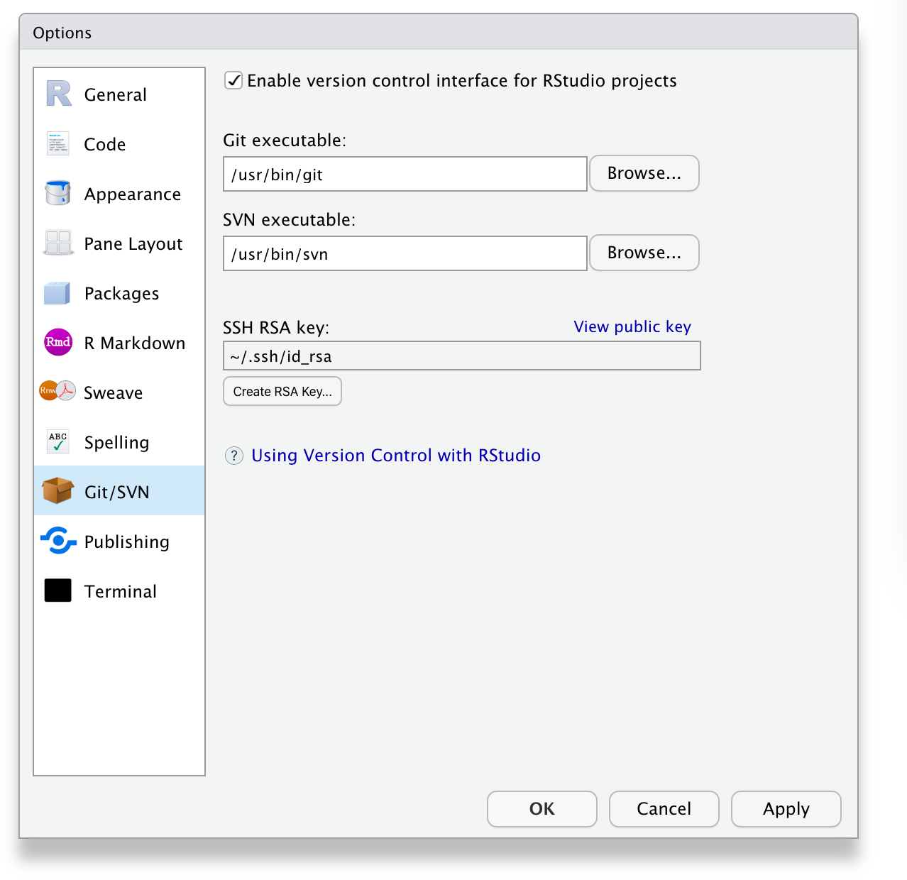
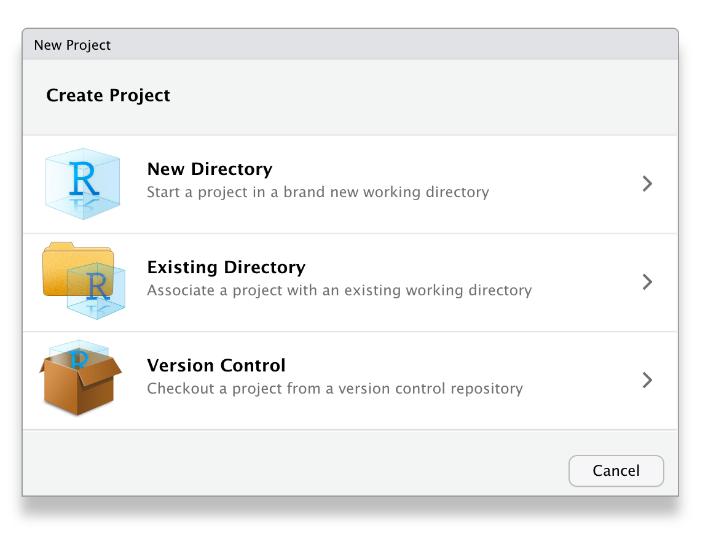
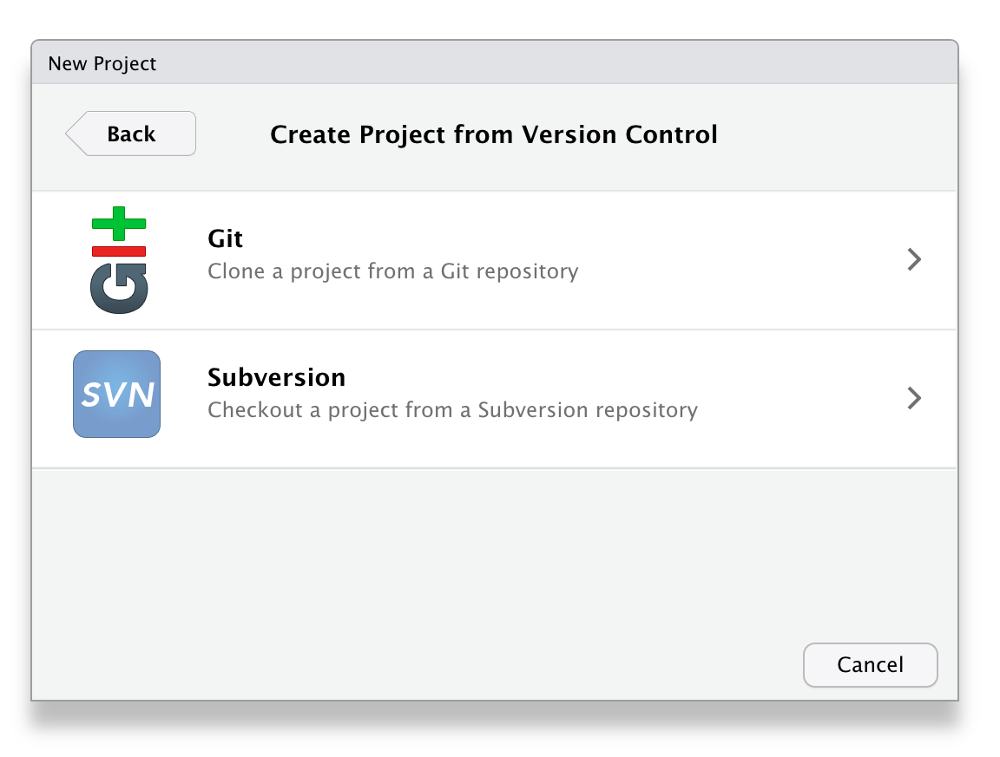
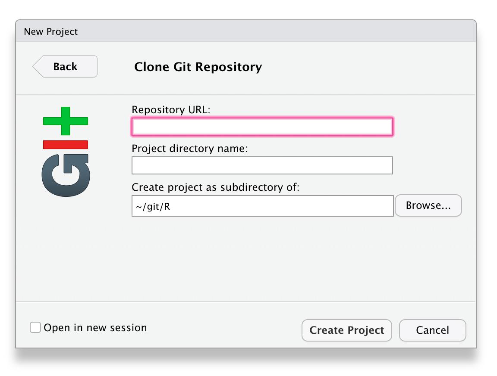
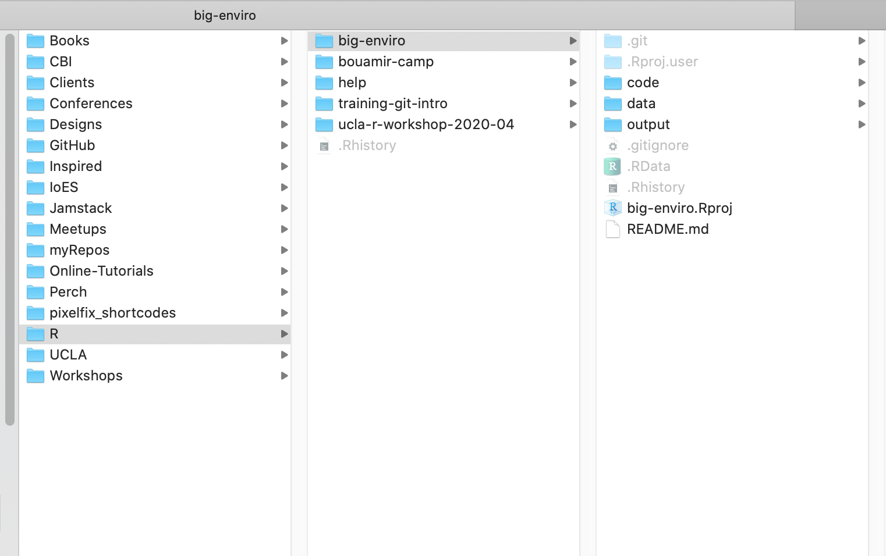
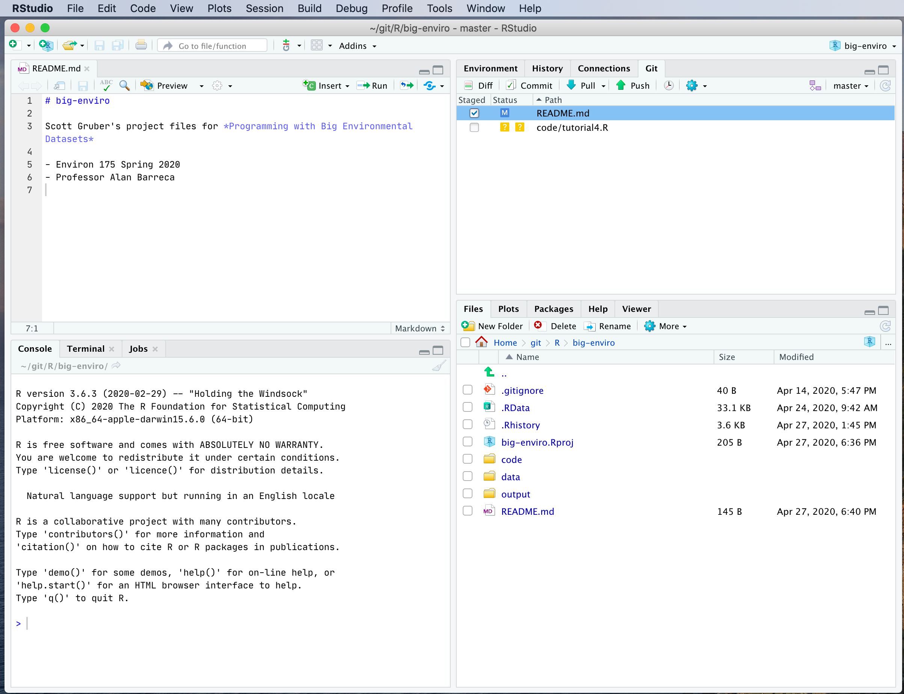
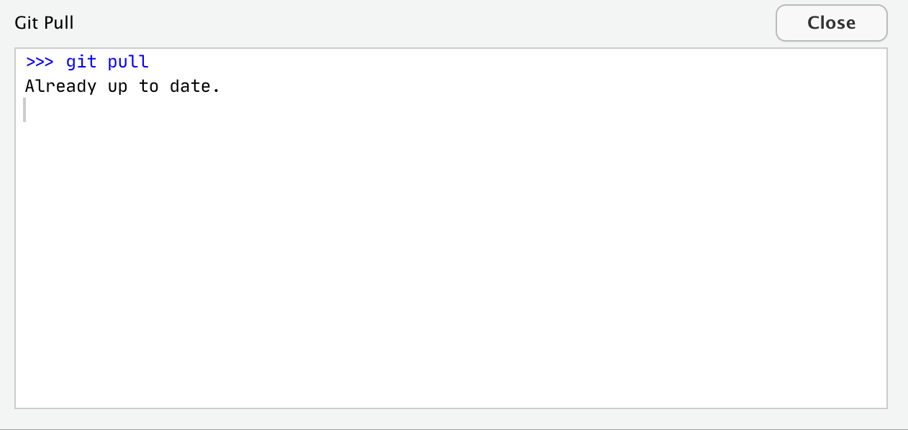
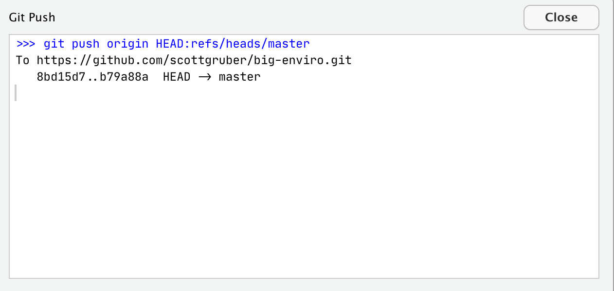
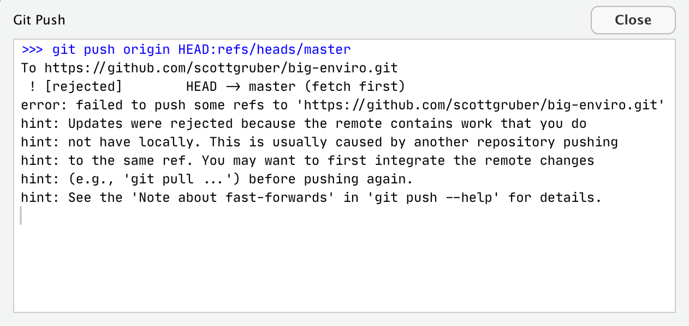

# Using `Git` with `RStudio`

A workshop to get started using version control with RStudio.

## We will cover:

- Why should I use version control?
- Setup
	- Join GitHub
  - Install git
  - Set up your identity
  - Activate Git in RStudio
- First Repository
  - Create a Repository on GitHub
  - Clone a Repository using RStudio
  - Make a change
  - Push change to GitHub
- Next Steps  
  - Share Code
  - Fork a Repo
  - Submit a pull request
  
--- 
  
## Why should I use version control?

**Have you ever:**

* Made a change to code, realized it was a mistake and wanted to revert back?
* Lost code or had a backup that was too old?
* Wanted to see the difference between two (or more) versions of your code?
* Wanted to prove that a particular change broke or fixed a piece of code?
* Wanted to review the history of some code?
* Wanted to submit a change to someone else’s code?
* Wanted to share your code, or let other people work on your code?
* Wanted to see how much work is being done, and where, when and by whom? 
* Wanted to experiment with a new feature without interfering with working code?
* Increase computational reproducibility for OpenScience

In these cases, and no doubt others, a version control system should make your life easier. 

---

## Setup 
### Join GitHub
https://github.com/join

---
### Install Git
Prior to using Git with RStudio you need to install Git. 

- Windows & OS X: <https://git-scm.com/downloads>
- Debian/Ubuntu linux: `sudo apt-get install git-core`
- Fedora/RedHat linux: `sudo yum install git-core`

A basic test for successful installation of git is to simply enter `git -v` in the Terminal. If you get a complaint about git not being found, it means installation was unsuccessful or that it is not being found, i.e. it is not on your PATH. 

If you are not sure where the git executable lives, try this in the Terminal:

`which git` (Mac, Linux)
`where git` (most versions of Windows)

Note: you can do the same for R. Just enter `R --version`

### Configure Git
Git associates your name and e-mail address with each commit, which helps when multiple people collaborate on a project. To configure your name and e-mail address in git, open the Terminal and run

```
git config --global user.name 'Your Name'
git config --global user.email 'your@email.com'
```
---

### Activate in R Studio
From RStudio, go to Tools > Global Options > Git/SVN and make sure that the checkbox to enable version control and the Git executable points to the Git executable. It should read something like:

`/usr/bin/git` (Mac, Linux)
`C:/Program Files (x86)/Git/bin/git.exe` (Windows)

On my computer, it looks like this:




---

## Your First Repository

Learning the language of Git takes time. Soon you'll be fluent in words and phrases like `clone`, or `make a commit`, or `fork a repo`, etc. 

Let's take our first steps. 

### Step 1: Make a new repository on GitHub

1. Go to GitHub.com and login.
1. Click the green “New” button
1. Name your repository name: `big-enviro`
1. Check public or private. 
1. Check Initialize this repository with a README
1. Click the green “Create repository” button
1. Copy the HTTPS clone URL to your clipboard via the green “Clone or Download” button.

### Step 2: Clone the repo to your computer via RStudio

1. In RStudio, start a new Project


1. File > New Project > Version Control > Git. 




1. In the “repository URL” paste the URL of your new GitHub repository. 
1. It will be something like `https://github.com/scottgruber/big-enviro`.
1. Decide where to store the local directory for the Project. 
1. Save all project files inside this directory. 

**Tip: Have central location where you keep projects on your computer.**  
On my computer, I created a folder named `git`, and a subfolder under it named `R` Each R project has a seperate subfolder under R. 

When you type from the terminal `pwd` you will get a path that looks something like this `/Users/scottgruber/git/R` or `/Users/scottgruber/git/R/big-enviro`

**Tips: Create well-organized file and folder structure for your projects**
1. Use only lowercase letters (unless it's R)
1. Avoid spaces in your filenames and folders
1. Separate the words in your filenames with hyphens

Your future-self will thank you. Here's what my folder structure looks like:




### Step 3: Make local changes, save, commit, push
**Tip**: Make a commit every time you finish a valuable chunk of work. Each commit adds to the project history. 

1. From RStudio, modify the README.md file by adding a sentence like `Project files for Programming with Big Environmental Datasets`. 
1. Save your changes.
1. Commit these changes to your local repo. How?



1. From RStudio:
1. Click the `Git` tab in the upper right pane.
1. Check the `Staged` box for any files whose existence or modifications you want to commit.
1. Type a message in `Commit message`. This should describe for a human, like your future self,  what changes you’ve made to the staged files.
1. Click `Commit`.


### Step 4: Push your local changes online to GitHub
**Tip**: Before you push your changes to GitHub, first you should pull from GitHub. Why? If you make changes to the repo in the browser or from another machine or (one day) a collaborator has pushed, you will be happier if you pull those changes in before you attempt to push.

1. Click the blue `Pull` button in the `Git` tab in RStudio. You’ll get the message `Already up-to-date` unless your repo has changed. This is just to establish a habit. 
2. Now click the green `Push` button to send your local changes to GitHub. You should see some message along these lines.






If you get an error you'll need to first integrate the remote changes before pushing again. 



Now, open your browser to look at your repo on GitHub. You'll see your commit message and when your code changed. Congratulations! You've made it! 


### The end?
Now just rinse and repeat. Do work. Save it. Commit it. Push it or pull it depending on where you did it, but get local and remote “synced up”.

--- 

## Next steps

`Git` is a very popular version control tool used by many data scientists and developers to share code. Learning Git is worth the investment. Github is one of several brands that host Git repositories. Other brands are [GitLab](https://about.gitlab.com/) and [Bitbucket](https://bitbucket.org/product). 

### Learning Git
Here are several free resources to learn more about Git.
- [Git Quickstart](https://help.github.com/articles/set-up-git/)
- [GitHub Guides](https://guides.github.com/)
- [Pro Git](https://git-scm.com/book/en/v2)
- [Version Control with Git – RStudio](https://support.rstudio.com/hc/en-us/articles/200532077?version=1.2.5033&mode=desktop)
- [Carpentries lesson — Version Control with Git](https://swcarpentry.github.io/git-novice/)
- [Happy Git and GitHub for the useR](https://happygitwithr.com)
### Learning R Markdown
- [R Markdown](https://rmarkdown.rstudio.com)


## Acknowledgments

- [National Center for Ecological Analysis and Synthesis](https://github.com/NCEAS/training-git-intro)
- [Computing for Social Sciences, University of Chicago](https://cfss.uchicago.edu/setup/git-with-rstudio/)

